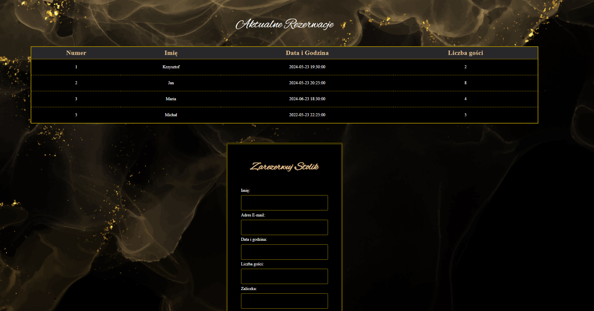
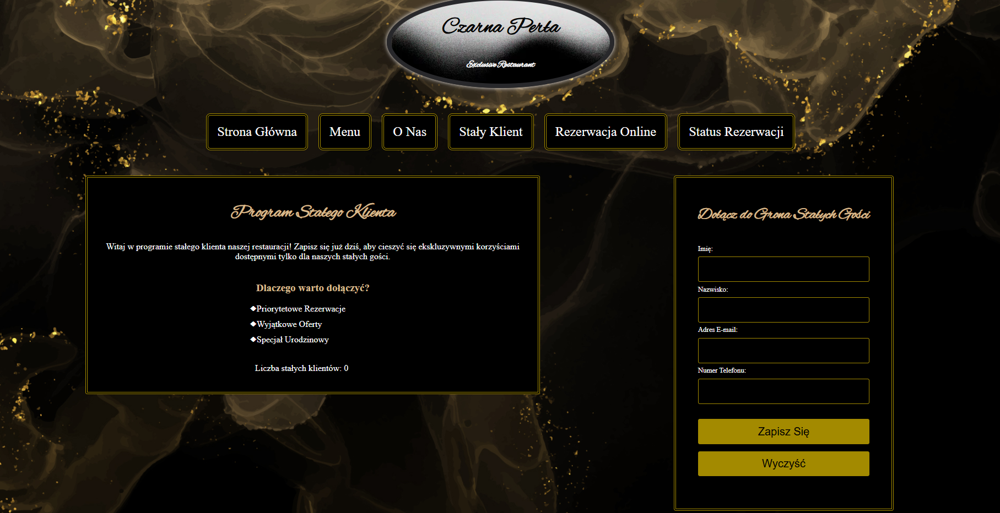

# Restaurant Reservation System

A full-stack web application for managing restaurant reservations, built in PHP with a MySQL relational database. The system handles the complete booking lifecycle — from customer registration to admin reporting.

---

## 🗄️ Database Design

The core of the project is a normalized relational MySQL database managing four interconnected entities:

```
customers                tables
  └── id                   └── id
  └── name                 └── number
  └── email                └── capacity
  └── password_hash        └── location

reservations                     
  └── id                            
  └── customer_id (FK → customers)  
  └── table_id    (FK → tables)      
  └── date                            
  └── time                           
  └── guests
  └── status (pending/confirmed/cancelled)
  └── created_at
```

---

## 🧩 Features

- **User auth** — registration and login with hashed passwords
- **Table reservation** — date, time, party size selection with real-time availability check
- **Conflict prevention** — SQL logic blocks double-booking of the same table/timeslot
- **Menu browsing** — full menu with categories and pricing
- **Admin panel** — manage reservations, customers, tables, and menu items
- **Reservation lookup** — customers can find and cancel their bookings
- **Email confirmations** — automated notifications on booking and cancellation
- **Responsive design** — works on desktop, tablet, and mobile

---

## 📸 Screenshots

| Home | Reservation | Admin |
|------|------------|-------|
|  |  |  |

---

## 🛠️ Tech Stack

| Layer | Technology |
|---|---|
| Backend | PHP 8 |
| Database | MySQL (normalized, relational schema) |
| Frontend | HTML, CSS, JavaScript |
| Styling | Bootstrap 5 |
| Auth | Session-based + password hashing |

---

## ⚙️ Local Setup

1. Import `restaurant_db.sql` into MySQL
2. Configure database connection in `autoryzacja.php`:

```php
$servername = "localhost";
$username   = "root";
$password   = "";
$dbname     = "restaurant_db";
```

3. Start a local PHP server:

```bash
php -S localhost:8000
```

---

## 🔭 Future Development

- **Analytics dashboard** — reservation trends, peak hours, table utilization rate
- **pandas export** — downloadable CSV/Excel reports for reservation history
- **Online payments** — Stripe integration for booking deposits
- **REST API** — decouple frontend and enable mobile app support

---

## 👨‍💻 Author

**Michał Ogiba** — Jagiellonian University, 2024  
[linkedin.com/in/michalogiba](https://linkedin.com/in/michalogiba) · [github.com/Mifiszon](https://github.com/Mifiszon)
