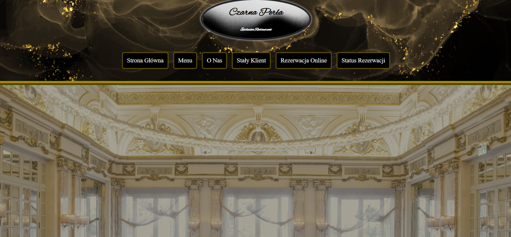
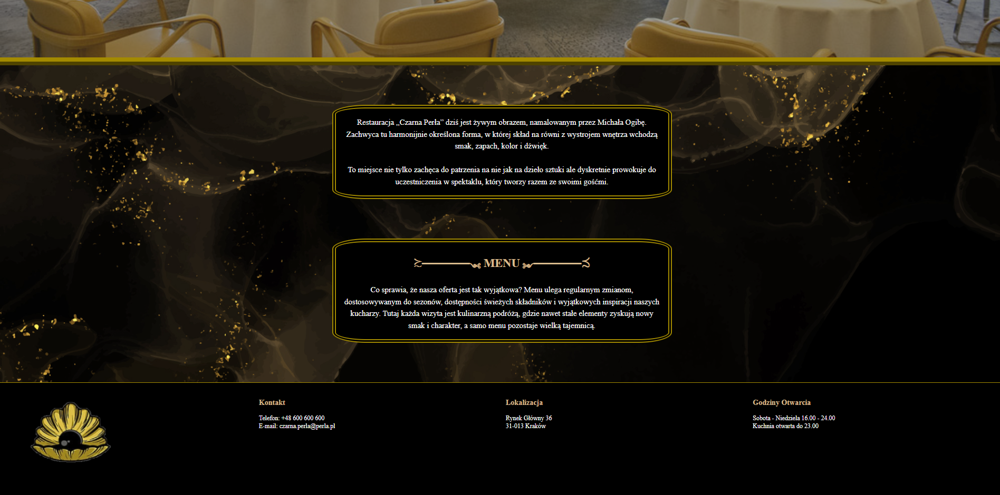
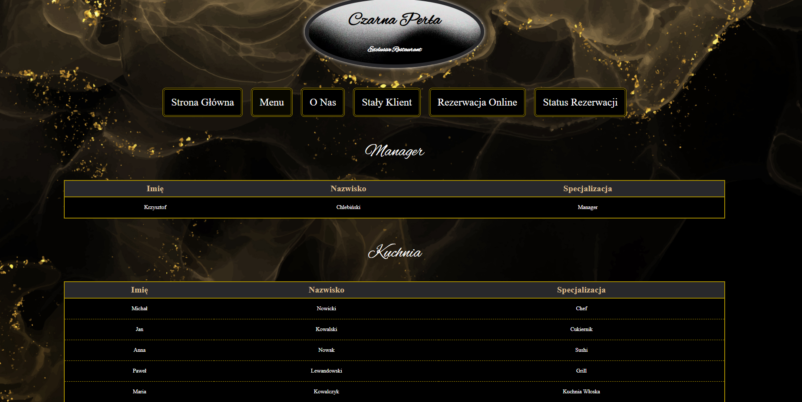
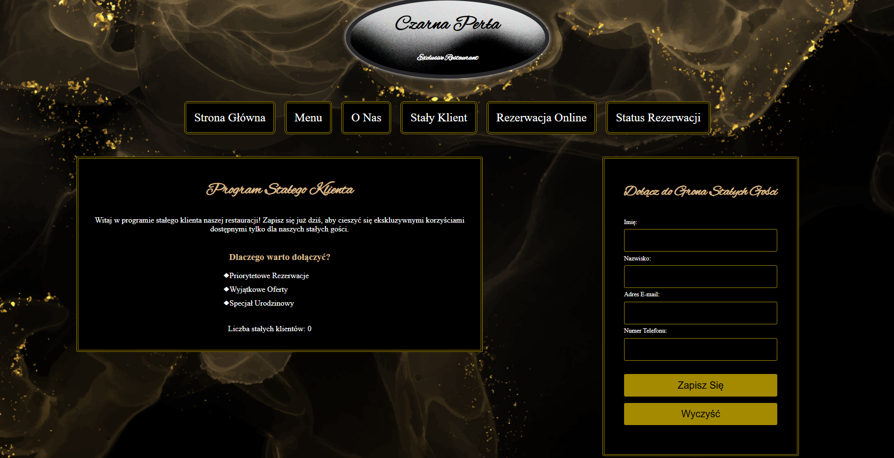
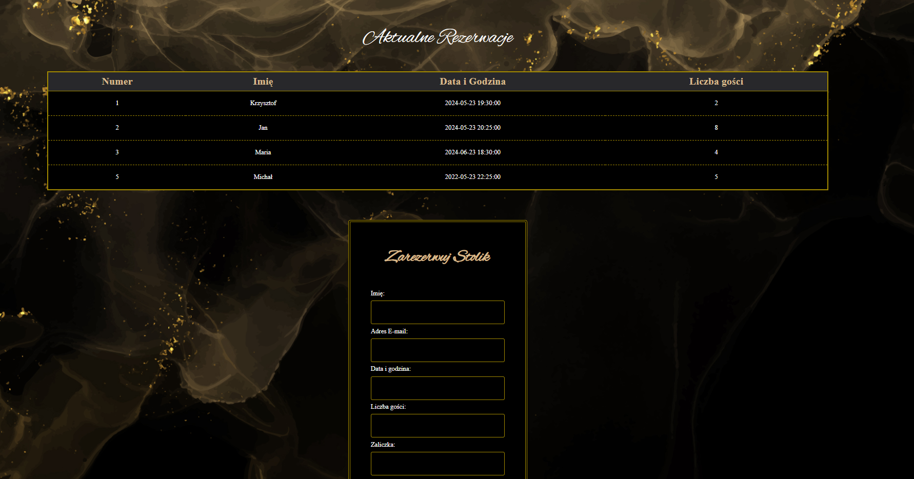
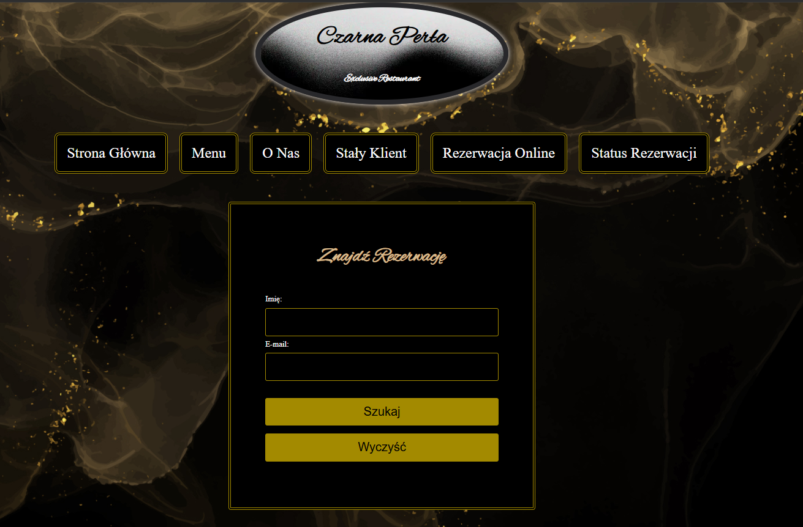

# Restaurant Reservation System

## Overview

This repository contains a **Restaurant Reservation System** developed in **PHP**. The system allows users to browse the restaurant menu, make reservations, and manage bookings through a user-friendly interface.

## Features

- **User Registration & Login** – Secure authentication for customers.
- **Table Reservation** – Users can select a date, time, and table for their booking.
- **Menu Browsing** – Customers can view the restaurant’s menu.
- **Admin Panel** – Manage reservations, customers, and menu items.
- **Email Notifications** – Confirmations for reservations.
- **Responsive Design** – Works on desktops, tablets, and mobile devices.

## Screenshots

### Home Page  

**Footer**

### About Page  

### Client Page  

### Reservation Page  

### Find Reservation Page  

## Database Configuration

Modify `config.php` to match your database settings:

$servername = "localhost";
$username = "root";
$password = "";
$dbname = "restaurant_db";

## Technologies Used

PHP – Backend logic

MySQL – Database

HTML, CSS, JavaScript – Frontend

Bootstrap – Responsive design

## Authors

Michał Ogiba
